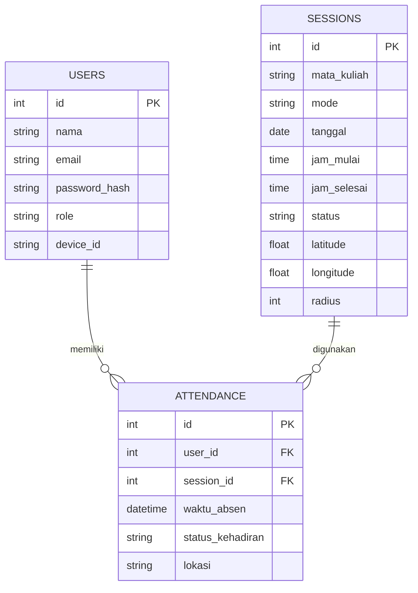

# ENTITY RELATIONSHIP DIAGRAM (ERD)
# SISTEM ABSENSI HYBRID QR DINAMIS

---

# Deskripsi Database

Database digunakan untuk:
- menyimpan data user
- menyimpan sesi absensi
- menyimpan data kehadiran mahasiswa
- mengelola mode online dan offline

---

# ENTITY UTAMA

## 1. USERS
Menyimpan data pengguna sistem.

### Role:
- mahasiswa
- dosen

---

## 2. SESSIONS
Menyimpan data sesi absensi yang dibuat dosen.

---

## 3. ATTENDANCE
Menyimpan data kehadiran mahasiswa.

---



# PENJELASAN RELASI

## USERS → ATTENDANCE

Relasi:
```text
1 : N
```

Artinya:
- 1 user dapat memiliki banyak data absensi
- setiap data absensi hanya dimiliki 1 user

---

## SESSIONS → ATTENDANCE

Relasi:
```text
1 : N
```

Artinya:
- 1 sesi absensi dapat memiliki banyak data kehadiran
- setiap data kehadiran hanya terkait dengan 1 sesi

---

# DETAIL TABEL

# TABLE USERS

| Field | Type | Keterangan |
|---|---|---|
| id | Integer | Primary Key |
| nama | Varchar | Nama user |
| email | Varchar | Email login |
| password_hash | Varchar | Password hash |
| role | Enum | mahasiswa / dosen |
| device_id | Varchar | ID perangkat |

---

# TABLE SESSIONS

| Field | Type | Keterangan |
|---|---|---|
| id | Integer | Primary Key |
| mata_kuliah | Varchar | Nama mata kuliah |
| mode | Enum | online / offline |
| tanggal | Date | Tanggal absensi |
| jam_mulai | Time | Waktu mulai |
| jam_selesai | Time | Waktu selesai |
| status | Boolean | Session aktif/tidak |
| latitude | Float | Lokasi kelas |
| longitude | Float | Lokasi kelas |
| radius | Integer | Radius valid GPS |

---

# TABLE ATTENDANCE

| Field | Type | Keterangan |
|---|---|---|
| id | Integer | Primary Key |
| user_id | Integer | Foreign Key users |
| session_id | Integer | Foreign Key sessions |
| waktu_absen | DateTime | Waktu absensi |
| status_kehadiran | Enum | hadir / terlambat / izin / alpha |
| lokasi | Text | Lokasi absensi |

---

# FLOW DATABASE

```text
Dosen Membuat Session
        ↓
Session Disimpan ke Database
        ↓
Mahasiswa Melakukan Absensi
        ↓
Data Kehadiran Disimpan ke Attendance
        ↓
Dashboard Menampilkan Rekap
```

---

# PRIMARY KEY

## USERS
```text
id
```

## SESSIONS
```text
id
```

## ATTENDANCE
```text
id
```

---

# FOREIGN KEY

## ATTENDANCE

```text
user_id → users.id
```

```text
session_id → sessions.id
```

---

# KONSEP DATABASE

Database menggunakan konsep relational database untuk menjaga hubungan antar data agar:
- lebih terstruktur
- mudah dikelola
- mudah dilakukan query
- mendukung rekap absensi

---

# POTENSI PENGEMBANGAN DATABASE

Fitur tambahan yang dapat ditambahkan:
- tabel mata kuliah
- tabel kelas
- tabel fakultas
- tabel jadwal kuliah
- tabel log aktivitas
- tabel notifikasi

---

# KESIMPULAN

ERD sistem absensi hybrid ini dirancang untuk mendukung:
- pengelolaan user
- session absensi
- pencatatan kehadiran
- validasi mode online dan offline

Struktur database dibuat sederhana agar mudah dikembangkan dan diimplementasikan menggunakan Python dan Flask.